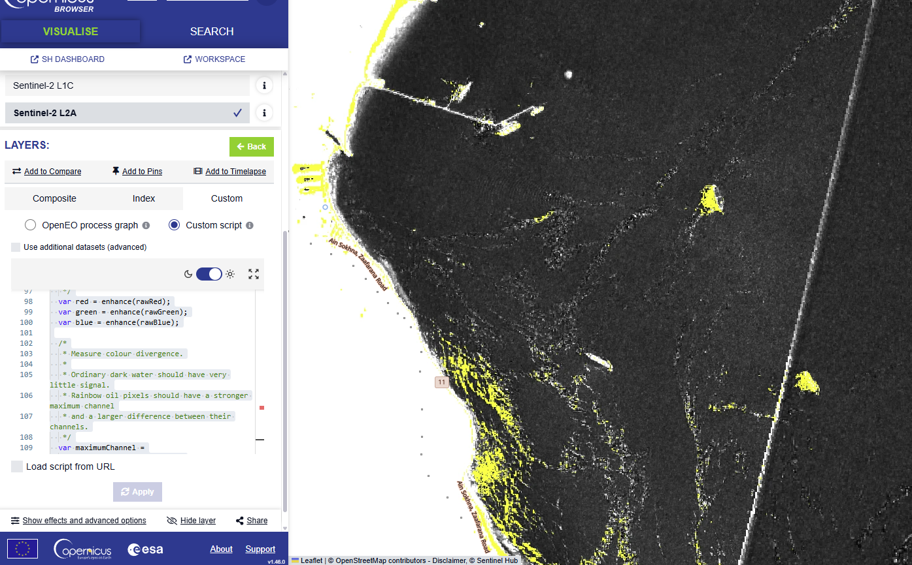
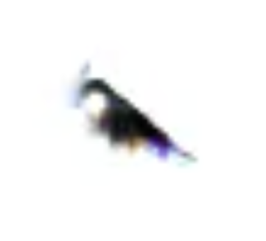
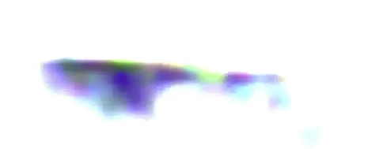

# Sentinel-2 Oil-Anomaly Highlighter for Copernicus Browser



A Copernicus Browser **Evalscript V3** that highlights strongly oil-like spectral anomalies as **bright yellow** while rendering all other valid pixels in monochrome.

The script was developed through visual experimentation with a Sentinel-2 oil-spill ratio composite. A strong nonlinear display transformation—approximately **gain 2.4** and **gamma 10**—caused most of the sea surface to collapse towards black while suspected oil features appeared as highly saturated rainbow-like anomalies. The script reproduces that behaviour programmatically, measures the resulting colour divergence, and replaces only the most extreme anomalies with yellow.


*when applying gain 2.4 and gamma 10 and no other formulas, the oil becomes the only thing visible*


*with that, the oil was a noticeable rainbow*


> [!IMPORTANT]
> This is a **visual screening and candidate-highlighting tool**, not a scientifically validated oil-spill classifier. A yellow pixel means that the pixel meets a highly selective spectral-anomaly rule in this particular ratio composite. It does not, by itself, confirm the presence of oil.

## What the script does

For every valid Sentinel-2 pixel, the script:

1. Builds a three-channel ratio composite from visible, red-edge, near-infrared and short-wave infrared bands.
2. Applies a strong nonlinear gain/gamma-style transformation to each channel.
3. Measures the transformed pixel's signal, chroma and saturation.
4. Marks only pixels with an almost maximally separated channel response as candidate oil anomalies.
5. Displays candidate pixels as pure yellow: `[1, 1, 0]`.
6. Converts every other valid pixel to monochrome.
7. Uses `dataMask` as the fourth output band so areas without source data remain transparent.

## Intended output

The expected visual result is:

- **Candidate anomalies:** bright yellow.
- **Water without a strong anomaly:** black or dark monochrome.
- **Other non-candidate surfaces:** monochrome, with brightness depending on the transformed composite.
- **No-data areas:** transparent.

Land may still be highlighted if it produces the same extreme transformed response. This version intentionally does not include a land mask because the immediate objective is to preserve the oil-like anomaly response that was visually successful.

## Full Evalscript

Paste the following into the **Custom script** editor in Copernicus Browser.

```javascript
//VERSION=3

/*
 * These reproduce the useful Browser appearance:
 * black background with strongly coloured oil anomalies.
 */
var EFFECT_GAIN = 2.4;
var EFFECT_GAMMA = 10.0;

/*
 * Classification controls.
 *
 * Increase these to highlight fewer pixels.
 * Decrease them to highlight more pixels.
 */
var MIN_SIGNAL = 1;
var MIN_CHROMA = 0.99;
var MIN_SATURATION = 0.99;

/*
 * Background brightness.
 *
 * Increase this if the monochrome background is too dark.
 */
var BACKGROUND_GAIN = 6.0;

function setup() {
  return {
    input: [{
      bands: [
        "B02",
        "B03",
        "B04",
        "B05",
        "B06",
        "B07",
        "B08",
        "B11",
        "B12",
        "dataMask"
      ],
      units: "REFLECTANCE"
    }],
    output: {
      bands: 4,
      sampleType: "AUTO"
    }
  };
}

function clamp(value, minimum, maximum) {
  return Math.max(minimum, Math.min(maximum, value));
}

function safeDivide(numerator, denominator) {
  return numerator / Math.max(denominator, 0.000001);
}

/*
 * Approximate the strong gain/gamma stretch that revealed
 * the rainbow-coloured oil features in the Browser.
 */
function enhance(value) {
  value = clamp(value, 0, 1);

  return clamp(
    EFFECT_GAIN * Math.pow(value, EFFECT_GAMMA),
    0,
    1
  );
}

function evaluatePixel(sample) {
  if (sample.dataMask === 0) {
    return [0, 0, 0, 0];
  }

  /*
   * Original RGB visualisation A from the OSI custom script:
   *
   * R = (B05 + B06) / B07
   * G = (B03 + B04) / B02
   * B = (B11 + B12) / B08
   */
  var rawRed =
    safeDivide(sample.B05 + sample.B06, sample.B07) / 3;

  var rawGreen =
    safeDivide(sample.B03 + sample.B04, sample.B02) / 3;

  var rawBlue =
    safeDivide(sample.B11 + sample.B12, sample.B08) / 3;

  /*
   * Apply the strong contrast transformation separately
   * to each channel.
   */
  var red = enhance(rawRed);
  var green = enhance(rawGreen);
  var blue = enhance(rawBlue);

  /*
   * Measure colour divergence.
   *
   * Ordinary dark water should have very little signal.
   * Rainbow oil pixels should have a stronger maximum channel
   * and a larger difference between their channels.
   */
  var maximumChannel =
    Math.max(red, green, blue);

  var minimumChannel =
    Math.min(red, green, blue);

  var chroma =
    maximumChannel - minimumChannel;

  var saturation =
    maximumChannel > 0.000001
      ? chroma / maximumChannel
      : 0;

  /*
   * Colourful pixels created by the enhanced ratio composite
   * are treated as candidate oil.
   */
  var isOilCandidate =
    maximumChannel >= MIN_SIGNAL &&
    chroma >= MIN_CHROMA &&
    saturation >= MIN_SATURATION;

  if (isOilCandidate) {
    return [1, 1, 0, sample.dataMask];
  }

  /*
   * Convert everything else to monochrome.
   */
  var gray =
    (0.299 * red) +
    (0.587 * green) +
    (0.114 * blue);

  gray = clamp(
    gray * BACKGROUND_GAIN,
    0,
    1
  );

  return [
    gray,
    gray,
    gray,
    sample.dataMask
  ];
}
```

## How the ratio composite works

The script creates three synthetic colour channels:

```text
Red channel   = ((B05 + B06) / B07) / 3
Green channel = ((B03 + B04) / B02) / 3
Blue channel  = ((B11 + B12) / B08) / 3
```

These are not ordinary red, green and blue reflectance channels. They are band-ratio channels designed to amplify differences between parts of the Sentinel-2 spectrum.

### Red synthetic channel

```text
(B05 + B06) / B07
```

This compares two red-edge bands against another red-edge band. It responds to changes in the relative shape of the spectrum around the red-edge wavelengths rather than overall brightness alone.

### Green synthetic channel

```text
(B03 + B04) / B02
```

This combines green and red reflectance and divides it by blue reflectance. It is the grayscale Oil Spill Index expression used in the original visualisation from which this script was developed.

### Blue synthetic channel

```text
(B11 + B12) / B08
```

This compares the two short-wave infrared bands against near-infrared reflectance. Water is normally strongly absorbing in NIR and SWIR wavelengths, so ratios involving these bands can become sensitive to small radiometric differences, atmospheric effects, glint, mixed pixels and floating surface material.

The division by `3` is a display scaling factor. It reduces the ratio values before they enter the normalised `0–1` output workflow.

## The gain/gamma-style transformation

Each synthetic channel passes through:

```javascript
EFFECT_GAIN * Math.pow(value, EFFECT_GAMMA)
```

with:

```javascript
EFFECT_GAIN = 2.4;
EFFECT_GAMMA = 10.0;
```

Values are clamped to `0–1` both before and after the transformation.

Because the exponent is very high, values below `1` are reduced sharply:

```text
0.5^10  ≈ 0.00098
0.7^10  ≈ 0.02825
0.8^10  ≈ 0.10737
0.9^10  ≈ 0.34868
1.0^10  = 1.00000
```

Multiplication by `2.4` then pushes only the strongest surviving responses towards the maximum output value. The practical effect is:

- weak and moderate channel responses become almost black;
- only exceptionally strong channels remain visible;
- differences between the transformed channels become highly conspicuous;
- pixels with one dominant channel can appear as intense primary or secondary colours in the unclassified composite.

This explains the observed **black image with rainbow-like oil features**. The script does not preserve those rainbow colours. Instead, it measures them and converts the most extreme ones to a uniform yellow mask.

> [!NOTE]
> This function reproduces the useful observed visual behaviour, but it should not be assumed to be an exact mathematical reproduction of every Copernicus Browser display implementation. Browser-side display effects may be applied after Evalscript processing and can vary depending on the active layer and interface settings.

## How a candidate pixel is selected

After enhancement, the script calculates three quantities.

### 1. Maximum channel signal

```javascript
var maximumChannel = Math.max(red, green, blue);
```

This tests whether at least one transformed channel has a strong response.

With:

```javascript
var MIN_SIGNAL = 1;
```

the maximum channel must equal the maximum possible output value after clamping. In practice, at least one transformed channel must be fully saturated.

### 2. Chroma

```javascript
var chroma = maximumChannel - minimumChannel;
```

Chroma measures the absolute separation between the strongest and weakest transformed channels.

With:

```javascript
var MIN_CHROMA = 0.99;
```

a pixel with `maximumChannel = 1` must have `minimumChannel <= 0.01`. This requires an almost complete separation between at least two channels.

### 3. Saturation

```javascript
var saturation = chroma / maximumChannel;
```

Saturation expresses the channel difference relative to the strongest channel.

With:

```javascript
var MIN_SATURATION = 0.99;
```

the pixel must be almost fully saturated rather than merely bright.

### Combined meaning of the selected thresholds

The three current rules are:

```javascript
maximumChannel >= 1 &&
chroma >= 0.99 &&
saturation >= 0.99
```

Because transformed channels are clamped to `0–1`, these thresholds are extremely selective. A qualifying pixel normally has:

- at least one channel at or extremely near `1`;
- at least one channel at or extremely near `0`;
- almost maximal colour separation.

This is why the current values suppress most ordinary water and many other bright surfaces while retaining the most intense rainbow anomalies.

## Why this approach was chosen

### A single OSI threshold was too broad

An earlier approach classified oil using only:

```javascript
(B03 + B04) / B02 >= threshold
```

That caused large parts of the image—including land and ships—to become yellow. The ratio is useful for visual enhancement, but a single threshold does not contain enough information to reliably separate oil from every other surface.

### Absolute brightness suppression removed the target

A later attempt rejected bright pixels to suppress ships. That also removed the suspected oil because oil can appear brighter than surrounding water under some acquisition conditions. Optical oil appearance depends on illumination, viewing geometry, sea state, oil properties and film thickness.

### The successful visual cue was channel divergence

The useful observation was not simply that oil was brighter or had a higher value in one index. It was that, after severe nonlinear enhancement, suspected spills produced **strongly divergent synthetic colour channels**, while most water became black.

The present script therefore classifies the visual anomaly that was actually observed:

```text
strong transformed signal
+ almost maximal channel separation
+ almost maximal saturation
= yellow candidate pixel
```

## Relationship to published research

Kolokoussis and Karathanassi's 2018 Sentinel-2 oil-spill study used object-based image analysis rather than a simple per-pixel threshold. Their method used multiresolution image segmentation and object-level properties including band ratios, within-object standard deviation, brightness differences between small objects and larger surrounding objects, geometric properties and distance from land.

The paper reported that oil-spill objects could have higher standard deviation and higher brightness than their larger surrounding objects. It also found value in the B02/B11 ratio and in a combined object feature based on `StdDev(B02) × B02/B11`, particularly in sun-glint areas.

This Evalscript does **not** reproduce that OBIA method. Copernicus Evalscript's `evaluatePixel()` calculates output values for individual pixels, so it does not directly provide connected-object area, shape, local object standard deviation, distance from land or comparison with segmented super-objects.

The present script should therefore be understood as a lightweight, scene-tuned visual approximation suitable for rapid inspection in Copernicus Browser.

## Why suspected oil can look like a rainbow

A normal RGB image maps physical red, green and blue reflectance to matching display channels. This script instead maps three different spectral ratios to RGB.

When the ratios react differently to the same surface feature:

- one transformed channel may approach `1`;
- another may remain close to `0`;
- the third may sit somewhere between them.

That produces highly saturated artificial colours. A feature may therefore appear red, green, blue, cyan, magenta or yellow depending on which synthetic channel dominates. The rainbow is not the physical colour of the oil. It is a visual representation of divergent ratio responses.

The script treats this divergence as the useful detection cue and standardises qualifying pixels to bright yellow.

## Background conversion

Pixels that do not qualify are converted to grayscale using perceptual RGB weights:

```javascript
var gray =
  (0.299 * red) +
  (0.587 * green) +
  (0.114 * blue);
```

The green synthetic channel contributes most to perceived brightness, followed by red and blue. The result is then multiplied by:

```javascript
var BACKGROUND_GAIN = 6.0;
```

This makes otherwise very dark non-candidate details easier to inspect without restoring their artificial colour.

## Parameter reference

| Parameter | Current value | Purpose | Effect of increasing it | Effect of decreasing it |
|---|---:|---|---|---|
| `EFFECT_GAIN` | `2.4` | Multiplies each channel after exponentiation | More strong values clip to `1` | Fewer values reach full intensity |
| `EFFECT_GAMMA` | `10.0` | Controls nonlinear suppression of sub-maximum values | Darker background and more extreme selectivity | More mid-range signal survives |
| `MIN_SIGNAL` | `1` | Minimum strongest transformed channel | Already at the maximum meaningful value | Allows weaker anomalies through |
| `MIN_CHROMA` | `0.99` | Minimum absolute max–min separation | More selective up to `1` | Accepts less extreme colour differences |
| `MIN_SATURATION` | `0.99` | Minimum relative colour separation | More selective up to `1` | Accepts less saturated anomalies |
| `BACKGROUND_GAIN` | `6.0` | Brightens only the grayscale background | Brighter non-candidate context | Darker background |

## Tuning guidance

The current thresholds are already close to the strictest possible values. Make small changes.

### Highlight slightly more candidate pixels

Try:

```javascript
var MIN_SIGNAL = 0.98;
var MIN_CHROMA = 0.95;
var MIN_SATURATION = 0.95;
```

Change only one parameter at a time and compare the result against the current version.

### Highlight fewer candidate pixels

`MIN_SIGNAL` cannot meaningfully be increased above `1`, because transformed outputs are clamped to `1`. Instead, make the other thresholds even stricter:

```javascript
var MIN_CHROMA = 0.995;
var MIN_SATURATION = 0.995;
```

If that is still insufficient, add a direct minimum-channel rule:

```javascript
var MAXIMUM_ALLOWED_MIN_CHANNEL = 0.005;
```

and include it in the candidate test:

```javascript
var isOilCandidate =
  maximumChannel >= MIN_SIGNAL &&
  minimumChannel <= MAXIMUM_ALLOWED_MIN_CHANNEL &&
  chroma >= MIN_CHROMA &&
  saturation >= MIN_SATURATION;
```

### Make the monochrome context brighter

Increase:

```javascript
var BACKGROUND_GAIN = 8.0;
```

This changes only the non-candidate display, not the candidate decision.

### Make the background darker

Reduce:

```javascript
var BACKGROUND_GAIN = 3.0;
```

## Copernicus Browser use

1. Open the required Sentinel-2 acquisition in Copernicus Browser.
2. Select **Visualize**.
3. Choose **Custom** from the available visualisations.
4. Open **Custom script**.
5. Paste the complete Evalscript.
6. Apply the visualisation.
7. Keep a record of the acquisition date, collection, processing level, selected scene and script version.

The script must be pasted into the JavaScript **Custom script** editor. It is not an openEO JSON process graph.

### External display settings

Because the gain/gamma-like transformation is included inside the script, a reproducible baseline is:

```text
Gain: 1
Gamma: 1
Red range: 0–1
Green range: 0–1
Blue range: 0–1
Mosaicking order: Layer default
```

Applying additional Browser gain or gamma after the script may still produce a visually useful result, but it changes the final display independently of the candidate-classification calculation. Record any such settings when saving screenshots or comparing scenes.

## Input bands

| Band | General Sentinel-2 region | Use in this script |
|---|---|---|
| `B02` | Blue | Denominator of the green synthetic ratio |
| `B03` | Green | Numerator of the green synthetic ratio |
| `B04` | Red | Numerator of the green synthetic ratio |
| `B05` | Red edge 1 | Numerator of the red synthetic ratio |
| `B06` | Red edge 2 | Numerator of the red synthetic ratio |
| `B07` | Red edge 3 | Denominator of the red synthetic ratio |
| `B08` | Near infrared | Denominator of the blue synthetic ratio |
| `B11` | SWIR 1 | Numerator of the blue synthetic ratio |
| `B12` | SWIR 2 | Numerator of the blue synthetic ratio |
| `dataMask` | Valid-data mask | Transparency and no-data handling |

The input object requests `REFLECTANCE` units. The output uses `sampleType: "AUTO"`, for which display values are expected in the `0–1` interval.

## No-data handling

The script checks:

```javascript
if (sample.dataMask === 0) {
  return [0, 0, 0, 0];
}
```

The fourth output band is alpha/transparency. Valid pixels return `sample.dataMask`, while no-data pixels return zero opacity.

`safeDivide()` also places a small floor under each denominator:

```javascript
Math.max(denominator, 0.000001)
```

This prevents division by zero and avoids `Infinity` or undefined ratio outputs.

## Known limitations and likely false positives

The following may create yellow pixels even when oil is absent:

- ships or bright marine structures;
- ship wakes;
- sun glint and glint boundaries;
- clouds and thin cloud;
- cloud edges and haze;
- shallow water and bright seabed contributions;
- suspended sediment;
- foam and breaking waves;
- mixed land–water pixels;
- resampling artefacts between bands of different native resolutions;
- sensor noise or very small denominators in ratio calculations;
- mosaic seams or differences between acquisitions.

The following may cause real oil to be missed:

- thin films with weak optical contrast;
- oil outside favourable illumination or viewing geometry;
- oil whose transformed response is bright but not highly saturated;
- heavy oil with a different spectral behaviour;
- atmospheric contamination;
- rough sea conditions;
- overly strict thresholds;
- use of a different Sentinel-2 processing level or scene without retuning.

## Pixel-level limitation

`evaluatePixel()` processes each output pixel independently. The script cannot determine whether a set of yellow pixels forms:

- a long coherent slick;
- a vessel-shaped object;
- a small isolated artefact;
- a feature of a particular physical area;
- an object located a specified distance from land.

Those tasks require spatial processing outside a basic Evalscript, such as connected-component analysis, segmentation, morphology, object-level statistics or GIS distance calculations.

## Recommended analytical workflow

Treat this script as the first stage of a review process.

### 1. Select a single acquisition

Prefer a clearly identified Sentinel-2 scene rather than an uncontrolled multi-date mosaic. Record the exact date, time, tile and processing level where available.

### 2. Review several visualisations

Compare:

- this yellow-anomaly output;
- the original ratio RGB composite;
- true colour;
- false-colour NIR/SWIR views;
- individual B02, B08 and B11 band displays.

### 3. Check temporal persistence

Compare the candidate feature with acquisitions before and after the event. A feature appearing only on one date may warrant further investigation, while a stable feature may be seabed, infrastructure or another persistent surface condition.

### 4. Inspect shape and context

Review whether the candidate:

- originates near a vessel, platform, pipeline or known seep;
- follows current or wind patterns;
- forms a coherent elongated surface feature;
- aligns with a ship wake;
- overlaps shallow water, coast, cloud or glint.

### 5. Cross-check other sensors and sources

Where possible, compare against:

- Sentinel-1 SAR imagery;
- higher-resolution optical imagery;
- vessel tracking data;
- incident reports;
- wind and sea-state information;
- known natural seep locations.

### 6. Export and post-process

For more rigorous analysis, export the underlying bands or candidate mask and apply:

- connected-component filtering;
- minimum-area rules;
- shape and elongation analysis;
- distance-from-land filtering;
- local standard deviation;
- comparison with surrounding neighbourhoods;
- multitemporal change detection.

## Validation and reproducibility checklist

Record the following whenever the script is used analytically:

- Sentinel-2 collection and processing level;
- acquisition date and time;
- tile or product identifier;
- area of interest;
- cloud coverage and visible haze;
- mosaicking setting;
- spatial sampling or resampling setting;
- external Browser gain and gamma;
- all script parameter values;
- script version or commit hash;
- known reference points used for tuning;
- screenshots of true colour and ratio composite;
- analyst judgement and uncertainty;
- corroborating imagery or reporting.

Do not tune thresholds on a suspected spill and then report performance on the same feature as independent validation. A stronger test uses known positive and negative scenes that were not used to choose the parameters.

## Interpretation language

Recommended wording:

> The script identified a highly saturated spectral-ratio anomaly consistent with the visual response observed over the suspected surface feature. The result is a candidate indicator requiring contextual and multitemporal verification; it is not confirmation of oil.

Avoid wording such as:

> The yellow pixels prove that oil is present.

## Further development

Potential improvements include:

- outputting a continuous anomaly score alongside the yellow visualisation;
- separating the red-, green- and blue-dominant anomaly classes;
- adding an optional conservative water mask;
- adding cloud and scene-classification masks for Sentinel-2 L2A;
- exporting a `FLOAT32` anomaly raster for external thresholding;
- performing connected-component and minimum-area filtering in Python or GIS;
- comparing current imagery with a clean reference acquisition;
- calibrating thresholds against labelled positive and negative examples;
- measuring precision and recall on a documented validation set.

## References

- Copernicus Data Space Ecosystem, **About the Browser**: custom visualisations, JavaScript custom scripts, and gain/gamma display controls.  
  <https://documentation.dataspace.copernicus.eu/Applications/Browser.html>

- Sentinel Hub, **Evalscript V3**: `//VERSION=3`, `setup()`, `evaluatePixel()`, input units, output bands and `sampleType: "AUTO"`.  
  <https://docs.sentinel-hub.com/api/latest/evalscript/v3/>

- Sentinel Hub, **dataMask**: handling no-data pixels and using a fourth output band as transparency.  
  <https://docs.sentinel-hub.com/api/latest/user-guides/datamask/>

- Kolokoussis, P. and Karathanassi, V. (2018), **Oil Spill Detection and Mapping Using Sentinel 2 Imagery**, *Journal of Marine Science and Engineering*, 6(1), 4.  
  <https://doi.org/10.3390/jmse6010004>

## Status

This version reflects the parameter combination that produced the most useful visual separation in the tested scene:

```javascript
var EFFECT_GAIN = 2.4;
var EFFECT_GAMMA = 10.0;
var MIN_SIGNAL = 1;
var MIN_CHROMA = 0.99;
var MIN_SATURATION = 0.99;
var BACKGROUND_GAIN = 6.0;
```

These values should be treated as **scene-tuned defaults**, not universal Sentinel-2 oil-detection thresholds.